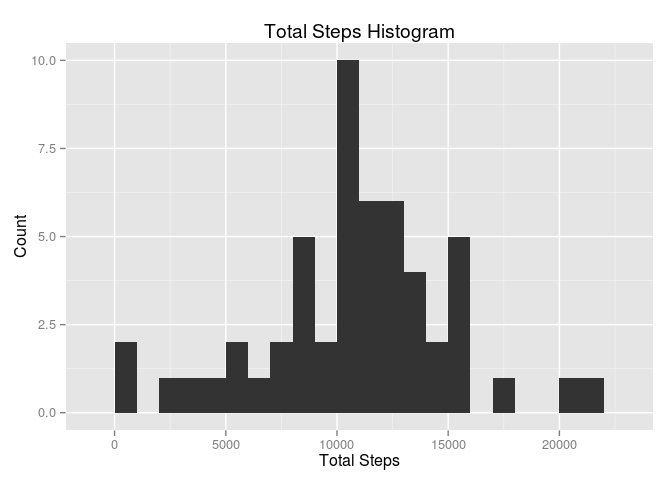
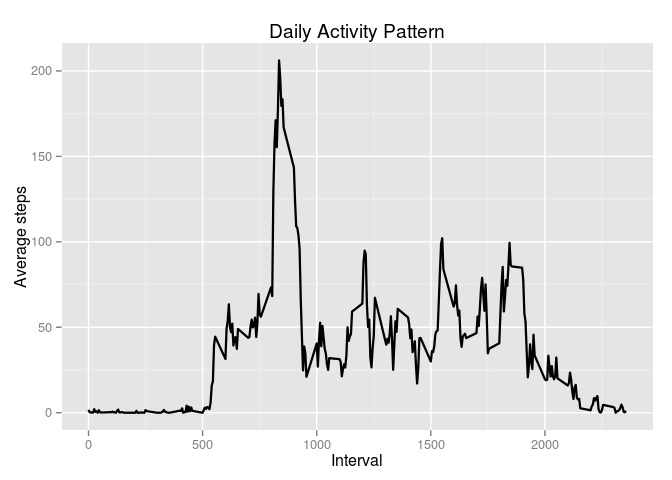
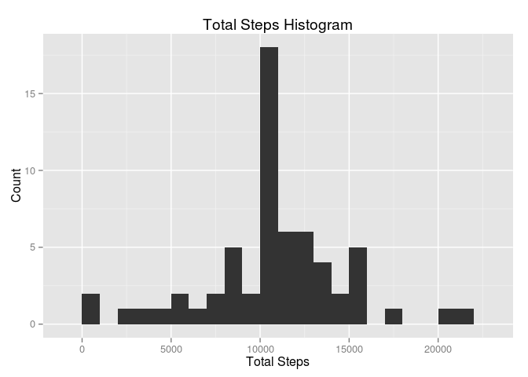
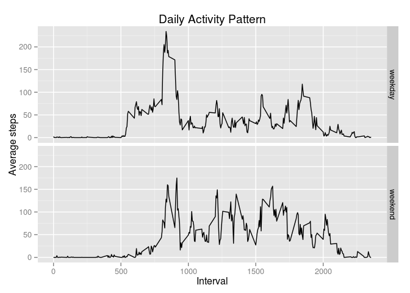

# Reproducible Research: Peer Assessment 1


## Loading and preprocessing the data

Load data into `data` variable and load `dplyr`, `lubridate`, `ggplot2` libraries.


```r
library(dplyr)
library(lubridate)
library(ggplot2)
data <- read.csv("activity.csv")
data <- mutate(data, date = ymd(date))
```


## What is mean total number of steps taken per day?

1. Calculate the total number of steps taken per day


```r
by.day <- data %>% 
  group_by(date) %>%
  summarise(total.steps = sum(steps))
```

2. Make a histogram of the total number of steps taken each day

```r
ggplot(by.day, aes(x = total.steps)) +
  geom_histogram(binwidth = 1000) +
  ggtitle("Total Steps Histogram") +
  ylab("Count") +
  xlab("Total Steps")
```

 

3. Calculate and report the mean and median of the total number of steps taken per day


```r
median(by.day$total.steps, na.rm = T)
```

```
## [1] 10765
```

```r
mean(by.day$total.steps, na.rm = T)
```

```
## [1] 10766.19
```
 
 * The **mean** total number of steps taken per day is:
  10765 steps
  
 * The **median** total number of steps taken per day is 
    1.0766189\times 10^{4} steps.

## What is the average daily activity pattern?

1. Make a time series plot of the 5-minute interval (x-axis) and the average number of steps taken, averaged across all days (y-axis)

```r
by.interval <- data %>% group_by(interval) %>% summarise(avg.steps = mean(steps, na.rm = T))

ggplot(by.interval, aes(x = interval, y = avg.steps)) +
  geom_line(size = 0.8) +
  ylab("Average steps") +
  xlab("Interval") +
  ggtitle("Daily Activity Pattern")
```

 

2. Which 5-minute interval, on average across all the days in the dataset, contains the maximum number of steps?


```r
by.interval[which.max(by.interval$avg.steps), ]$interval
```

```
## [1] 835
```

Maximum number of of steps belong to 835 interval

## Imputing missing values

1. Calculate and report the total number of missing values in the dataset (i.e. the total number of rows with NAs)

Total missing values in dataset:


```r
sum(is.na(data$steps))
```

```
## [1] 2304
```

2. Devise a strategy for filling in all of the missing values in the dataset.

My strategy is to use average vaalue for particular interval that item belongs to. Function `avg.for.interval` is used to determine average value for particular interval.


```r
by.interval <- data %>%
  group_by(interval) %>%
  summarise(avg.steps = mean(steps, na.rm = T))

avg.for.interval <- function(interval.to.select) { 
  by.interval %>%
      filter(interval == interval.to.select) %>%
      select(avg.steps)
}
```

3. Create a new dataset that is equal to the original dataset but with the missing data filled in.


```r
without.na <- data

for (i in 1:nrow(without.na)) {
  if (is.na(without.na[i, ]$steps)) {
      without.na[i, ]$steps <- as.numeric(avg.for.interval(without.na[i, ]$interval))
  }
}
```

4. Make a histogram of the total number of steps taken each day.


```r
by.day <- without.na %>%
  group_by(date) %>%
  summarise(total.steps = sum(steps))

ggplot(by.day, aes(x = total.steps)) +
  geom_histogram(binwidth = 1000) +
  ggtitle("Total Steps Histogram") +
  ylab("Count") +
  xlab("Total Steps")
```

 

Calculate and report the mean and median total number of steps taken per day.


```r
median(by.day$total.steps, na.rm = T)
```

```
## [1] 10766.19
```

```r
mean(by.day$total.steps, na.rm = T)
```

```
## [1] 10766.19
```

Do these values differ from the estimates from the first part of the assignment? What is the impact of imputing missing data on the estimates of the total daily number of steps?

**Mean is identical, though median is a little bit different cause I used average interval for missing values median becamo closer to average. **


## Are there differences in activity patterns between weekdays and weekends?

1. Create a new factor variable in the dataset with two levels – “weekday” and “weekend” indicating whether a given date is a weekday or weekend day.


```r
with.day.type <- data %>% 
  mutate(wday = wday(date)) %>% 
  mutate(day.type = as.factor(ifelse((wday - 1) %% 6 == 0, "weekend", "weekday")))
```

2. Make a panel plot containing a time series plot of the 5-minute interval (x-axis) and the average number of steps taken, averaged across all weekday days or weekend days (y-axis). 


```r
avg.by.interval <- with.day.type %>% group_by(interval, day.type) %>% summarise(avg.steps = mean(steps, na.rm = T))
 
ggplot(avg.by.interval, aes(x = interval, y = avg.steps)) +
  geom_line(size = 0.5) +
  ylab("Average steps") +
  xlab("Interval") +
  ggtitle("Daily Activity Pattern") +
  facet_grid(day.type ~ .)
```

 

**There a some differences between weekday and weekend activity patterns. There is obvious peak in weekday cause everybody goes do work, though on weekend there is more movement all day long compared to weekday.**

